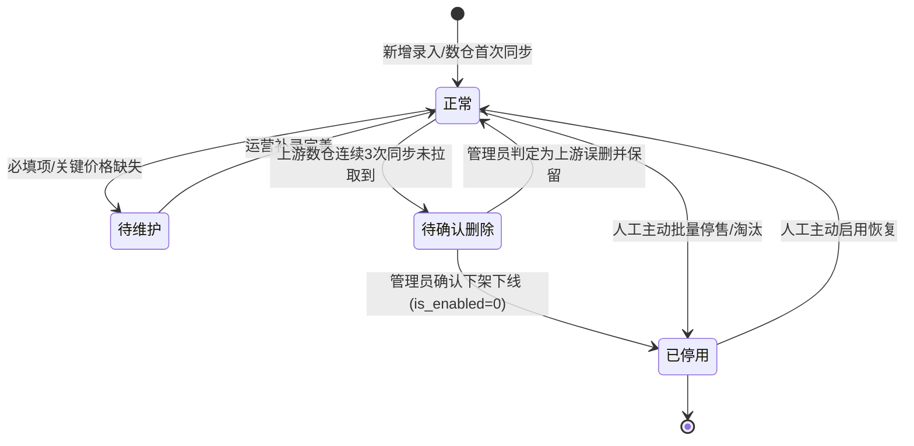
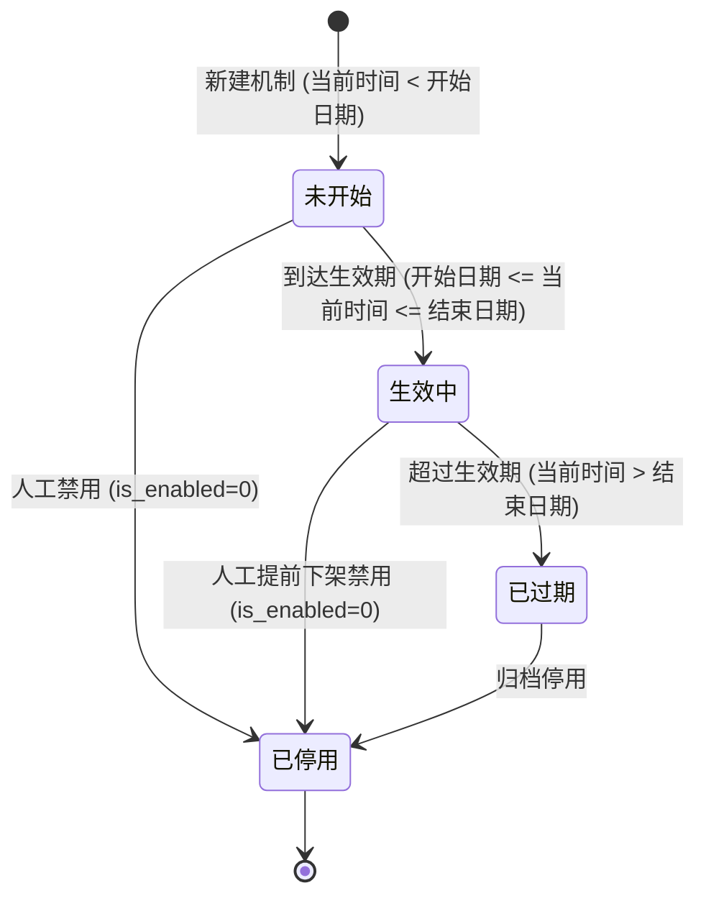
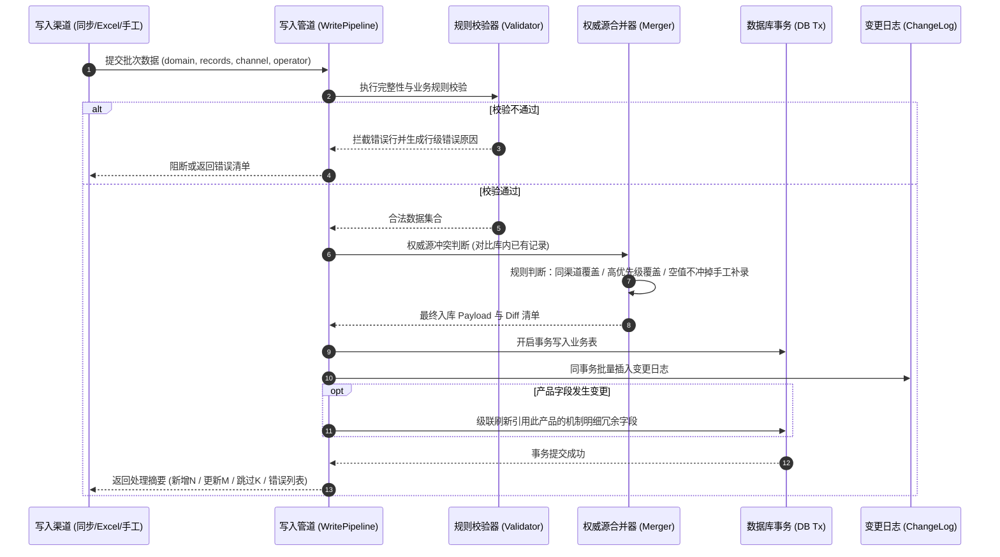
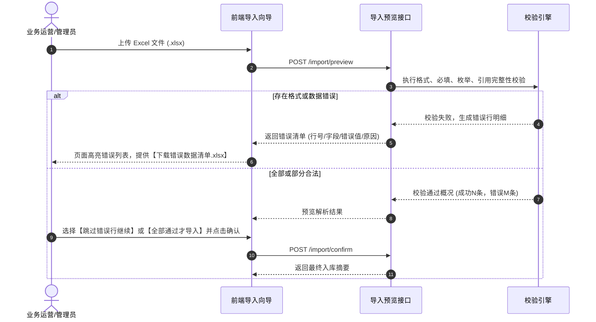

# 主数据管理系统 产品规划

> 版本：v1.0（正式待定稿） ｜ 日期：2026-09-30 ｜ 状态：待评审定稿
> 定位：轻量主数据中心——一数一源、多渠道入、统一出

---

## 1. 背景与目标

### 1.1 背景

产品（货品）与机制（促销套装）数据目前散落在各业务平台和人工表格中，存在典型问题：

- **口径不一**：同一货品在各平台编码、名称、状态、零售价可能不一致，跨部门跨系统报表对不上；
- **更新滞后**：数据靠人工导出再导入，业务平台修改后，下游使用方难以及时获知；
- **无统一出口**：各业务口各取各的数，缺乏企业级可信的权威基准源；
- **机制数据尤其薄弱**：机制缺少全局唯一编码、有效生效期、机制核定价格等关键属性，长期依赖表格口头同步，无法标准化管理。

### 1.2 目标

建设一个**轻量主数据管理系统**，实现：

| 目标 | 衡量方式 |
|------|---------|
| **数据唯一可信** | 产品以「货品编号」、机制以「机制编码」为唯一业务主键；权威来源与优先级明确 |
| **维护省心省力** | 80% 以上的数据变更由数仓同步/标准导入自动完成，人工仅聚焦异常处理与小批量补录 |
| **供数标准化** | 各业务口与下游系统（如销售计划、经营分析）从统一出口取数（页面 / Excel / 开放 API），告别手工表格流转 |

### 1.3 设计原则

1. **前期从简**：数据量产品万条以内、机制数百条，采用高内聚轻量单体架构，优先做扎实「数据齐、入口通、留痕全」；
2. **变更必留痕**：不设复杂冗长的前置审批流，但每一次数据变更（无论来自定时同步、Excel 导入还是手工修改）均字段级全量留痕、可回溯、可对账；
3. **权威源可配置**：同一记录多渠道写入冲突时，按可配置的优先级自动合并，辅以「手工修改保护」与「空值不覆盖」，保障数据稳定性。

---

## 2. 范围界定

### 2.1 本期纳入（V1）

| 数据域 | 说明 | 预估规模 | 关键落地要求 |
|--------|------|---------|------------|
| **产品信息域** | 货品基础档案：编码、名称、规格、单位、品牌、类目、零售价、状态等 | ≤ 1 万条 | 21 列原始字段全覆盖 + 枚举化收敛 |
| **机制信息域** | 促销机制档案：机制编码、套装类型、机制类型、生效期、机制价格、商品组合明细等 | ≤ 数百条 | 规范编码规则 + 主子表明细结构化管理 |

### 2.2 暂不纳入（预留扩展位）

- 店铺、品牌、类目等维表的独立树状层级管理（本期作为产品表中的标准文本/枚举字段，V2 升级为独立维表）；
- 复杂多级流程审批（本期实行轻量宽进严管，以变更留痕与待确认看板替代）；
- 跨企业级数据血缘追溯与实时质量评分大屏（V2 扩展）。

---

## 3. 用户与使用场景

| 角色 | 谁来承担 | 典型场景 | 核心诉求 |
|------|---------|---------|---------|
| **数据管理员** | 主数据负责人 | 监控定时同步、处理同步异常、审批「待确认删除」记录、配置枚举字典与权威源优先级 | 看得见每个数据从哪来、改过什么；异常能快速定位并处置 |
| **业务运营** | 各业务口运营同事 | 多维筛选查询产品/机制、导出报表数据、Excel 批量维护、临时手工新增与微调机制 | 查得快、导出规范、修改灵活且有防呆校验 |
| **下游业务系统** | 销售计划、经营分析系统等 | 按编码批量拉取最新档案、按更新时间游标（`since`）增量拉取变更 | 接口稳定、口径统一、变更感知低延迟 |

---

## 4. 总体方案与业务流程

### 4.1 系统定位

**同步中枢 + 维护工作台 + 统一供数出口**，三层一体：

```
┌─────────────────────────── 数据来源（入） ───────────────────────────┐
│                                                                      │
│  通道A 数仓同步      通道B Excel导入     通道C API推送     通道D 手工维护 │
│ （主通道，定时）    （批量，模板校验）    （预留，V2契约）   （单条/批量）  │
└──────────────┬───────────────────────────────────────────────────────┘
               ▼
     ┌──────────────────────┐
     │  清洗 / 校验 / 合并    │   ← 唯一性、必填、枚举、格式、引用完整性校验
     │  （按权威源优先级）     │   ← 冲突按优先级合并，非空覆盖与字段保护，全程留痕
     └──────────┬───────────┘
                ▼
     ┌──────────────────────┐
     │  主数据库 (Postgres)  │
     │  ├─ 产品信息表         │
     │  ├─ 机制信息主表       │
     │  ├─ 机制商品明细子表   │
     │  └─ 变更日志表         │
     └──────────┬───────────┘
                ▼
┌─────────────────────────── 数据分发（出） ───────────────────────────┐
│                                                                      │
│  查询页面   导出(Excel)   批量查询API(按编码)   增量同步API(按更新时间) │
└──────────────────────────────────────────────────────────────────────┘
```

### 4.2 核心机制：变更留痕 (Audit Trail)

所有写入路径统一经过校验与合并层，每次变更记录：

$$\text{对象类型} + \text{业务主键} + \text{变更字段} + \text{旧值} \rightarrow \text{新值} + \text{操作人/渠道} + \text{操作时间}$$

变更日志与业务数据**同事务写入**，确保强一致性，为数据核对与争议溯源提供不可篡改的依据。

### 4.3 数据生命周期流转状态机

#### 4.3.1 产品全生命周期流转



#### 4.3.2 机制全生命周期流转

机制生命周期由系统根据「有效生效期（开始日期 ~ 结束日期）」及启用状态动态计算，避免人工维护滞后：



### 4.4 写入管道 (WritePipeline) 处理流程



---

## 5. 数据模型与标准字典规划

### 5.1 产品信息表 (Product)

唯一业务主键：**货品编号 (`code`)**。字段清单（对齐业务原始 21 列 + 系统审计列）：

| # | 字段标识 | 业务列名 | 数据类型 | 必填 | 唯一 | 空值策略 | 业务说明与校验规则 |
|---|----------|----------|----------|:----:|:----:|:--------:|-------------------|
| 1 | `code` | 货品编号 | 文本(50) | ✅ | ✅ | 拒绝 | 主键，所有渠道对接基准，去空格大写 |
| 2 | `name` | 货品名称 | 文本(200) | ✅ | | 拒绝 | 完整标准商品名称 |
| 3 | `spec` | 型号规格/净含量 | 文本(100) | | | 允许 | 包装规格，如 50ml、30g*2 |
| 4 | `base_unit` | 基本单位 | 枚举 | | | 允许 | 引用枚举字典，如：瓶/盒/支/套/罐 |
| 5 | `short_name` | 货品简称 | 文本(100) | | | 允许 | 运营常用简写 |
| 6 | `brand` | 品牌 | 文本(50) | ✅ | | 拒绝 | 品牌标识（如珀莱雅、彩棠、Off&Relax等） |
| 7 | `product_category` | 产品类目 | 文本(50) | | | 允许 | **正式主口径类目**（如护肤、彩妆、洗护） |
| 8 | `category_sub` | 产品分类 | 文本(50) | | | 允许 | 二级细分分类（如洁面、精华、面霜） |
| 9 | `retail_price` | 零售价 | 数值(12,2) | | | 允许 | 官方吊牌/零售指导价，必须 ≥ 0 |
| 10 | `nickname` | 昵称 | 文本(100) | | | 允许 | 业务常用产品昵称（支持运营手工补录且受保护） |
| 11 | `version` | 版本 | 文本(50) | | | 允许 | 产品代际/配方版本（如 2.0版、升级版） |
| 12 | `series` | 系列 | 文本(50) | | | 允许 | 所属产品线系列（如红宝石系列、双抗系列） |
| 13 | `category_old` | 类目（旧口径） | 文本(50) | | | 允许 | **已废弃口径**，仅作历史兼容只读展示，模板不再提供 |
| 14 | `sample_type` | 正品/小样 | 枚举 | | | 允许 | 字典：`正品`、`小样` |
| 15 | `status` | 商品状态 | 枚举 | ✅ | | 默认`正常` | 字典：`正常`、`停售`、`淘汰` |
| 16 | `carton_spec` | 箱规 | 文本(50) | | | 允许 | 整箱装箱数与规格说明 |
| 17 | `sale_stage` | 在售/新品 | 枚举 | | | 允许 | 字典：`在售`、`新品`、`预售`、`清尾` |
| 18 | `auxiliary` | 辅助标记 | 数值 | | | 允许 | 业务自定义标记位 |
| 19 | `needs_maintenance` | 是否需要维护 | 枚举 | | | 默认`否` | 字典：`是`、`否`，标识是否需运营补充维护数据 |
| 20 | `upstream_created_at` | 上游创建时间 | 日期时间 | | | 允许 | 同步源系统原始生成时间 |
| 21 | `upstream_write_date` | 上游写入日期 | 日期 | | | 允许 | 同步源系统原始更新日期 |

**系统管理审计列**：

| 字段标识 | 业务列名 | 类型 | 说明 |
|----------|----------|------|------|
| `data_source` | 数据来源渠道 | 枚举 | 最近一次变更渠道：`数仓同步` / `Excel导入` / `API推送` / `手工维护` |
| `source_updated_at` | 来源更新时间 | 日期时间 | 本系统最近一次字段实际更新时间（供下游增量同步） |
| `is_enabled` | 是否启用 | 布尔 | 启停状态（`True` 启用，`False` 禁用，禁用后业务口默认不返回） |
| `pending_delete` | 待确认删除 | 布尔 | 上游数仓消失标记，需管理员人工确认 |
| `is_locked` | 字段保护锁定 | 布尔 | 手工修正后锁定标记，开启时不被自动同步覆盖 |
| `created_at` / `updated_at` | 系统创建/更新时间 | 日期时间 | 数据库系统级审计时间戳 |

---

### 5.2 机制信息表与明细子表 (Mechanism & Items)

唯一业务主键：**机制编码 (`code`)**。支持上游自带编码或由系统生成规则码。

#### 5.2.1 机制主表

| # | 字段标识 | 业务列名 | 数据类型 | 必填 | 唯一 | 说明与校验规则 |
|---|----------|----------|----------|:----:|:----:|----------------|
| 1 | `code` | 机制编码 | 文本(50) | ✅ | ✅ | 主键；系统生成规则见下文 |
| 2 | `name` | 机制名称 | 文本(200) | ✅ | | 促销机制全名（如：双抗精华双支买赠机制） |
| 3 | `kit_type` | 套装类型 | 枚举 | | | 字典：`单件`、`多件组合`、`买赠套装`、`加价购` |
| 4 | `mechanism_type` | 机制类型 | 枚举 | | | 字典：`日常促销`、`S促`、`D11/618大促`、`超头直播`、`头部主播` |
| 5 | `source` | 数据来源 | 枚举 | ✅ | | 来源渠道（数仓 / Excel / API / 手工） |
| 6 | `audit_status` | 审核状态 | 文本(50) | | | 上游业务系统审核状态透传（只读展示，不参与流转） |
| 7 | `start_date` | 生效开始日期 | 日期 | | | 机制开始生效日期 |
| 8 | `end_date` | 生效结束日期 | 日期 | | | 机制失效结束日期，必须 ≥ 开始日期 |
| 9 | `mechanism_price` | 机制价格 | 数值(12,2) | | | 套装核定结算/机制销售价，必须 ≥ 0 |
| 10 | `short_name` | 机制简称 | 文本(100) | | | 运营简写名称 |
| 11 | `brand` | 品牌 | 文本(50) | | | 所属品牌，支持随主品自动推导或人工指定 |
| 12 | `creator` | 创建人 | 文本(50) | | | 录入或上游创建人 |
| 13 | `upstream_created_at` | 创建时间 | 日期时间 | | | 上游创建时间 |
| 14 | `upstream_updated_at` | 更新时间 | 日期时间 | | | 上游更新时间 |

**机制编码系统生成规范**：
当上游或运营未提供机制编码时，系统按如下规则自动生成：
$$\mathbf{M\text{-}\{品牌缩写\}\text{-}\{年月YYYYMM\}\text{-}\{4位自增流水号\}}$$
示例：`M-PROYA-202610-0001`、`M-CT-202610-0023`。保证全局唯一且具备业务可读性。

#### 5.2.2 机制商品明细表 (`mechanism_item`)

| 字段标识 | 业务列名 | 类型 | 必填 | 说明 |
|----------|----------|------|:----:|------|
| `id` | 自增主键 | 整型 | ✅ | 代理主键 |
| `mechanism_code` | 机制编码 | 文本(50) | ✅ | 外键，关联 `mechanism.code` |
| `product_code` | 货品编号 | 文本(50) | ✅ | 外键，关联 `product.code`；**必须存在且启用** |
| `product_name` | 商品名称 | 文本(200) | | 冗余存储，产品档案修改时级联刷新 |
| `product_short_name`| 商品简称 | 文本(100) | | 冗余存储 |
| `product_spec` | 型号规格 | 文本(100) | | 冗余存储 |
| `retail_price` | 零售价 | 数值(12,2)| | 冗余存储 |
| `quantity` | 数量 | 整型 | ✅ | 包含件数，必须为正整数（> 0） |
| `item_type` | 商品类型 | 枚举 | ✅ | 字典：`主品`、`赠品` |

**约束条件**：
- 联合唯一索引：`UNIQUE(mechanism_code, product_code)`，同一机制内商品不重复；
- 引用完整性：录入的 `product_code` 必须在产品信息表中存在且 `is_enabled = True`，否则阻断并报错。

---

### 5.3 初始枚举字典规划 (`enum_config`)

系统预置标准枚举项如下，管理员后续可在控制台增改配置：

| 领域 (`domain`) | 字段 (`field_name`) | 预置枚举值列表 | 备注 |
|-----------------|---------------------|----------------|------|
| `product` | `base_unit` | 瓶、盒、支、套、罐、袋、片、件、支/盒 | 计量单位 |
| `product` | `sample_type` | 正品、小样 | 商品形态 |
| `product` | `status` | 正常、停售、淘汰 | 商品生命周期状态 |
| `product` | `sale_stage` | 在售、新品、预售、清尾 | 销售阶段 |
| `product` | `needs_maintenance` | 是、否 | 运营待维护标记 |
| `mechanism` | `kit_type` | 单件、多件组合、买赠套装、加价购、体验包 | 套装形态 |
| `mechanism` | `mechanism_type` | 日常促销、S促、D11/618大促、超头直播、头部主播、自播专属 | 促销场景 |
| `mechanism_item`| `item_type` | 主品、赠品 | 机制明细品类 |

---

## 6. 数据来源、同步与导入规范

### 6.1 四通道分工

| 通道 | 定位 | 运行模式 | 权限控制 | V1 状态 |
|------|------|----------|----------|:-------:|
| **A 数仓同步** | 权威基准通道，定时从数仓拉取产品全量及机制 | 每日凌晨定时 + 管理员手动重跑 | 系统后台运行 | ✅ P0 落地 |
| **B Excel 导入** | 批量导入新增机制、批量补充产品缺失字段 | 页面向导上传（下载模板 → 预览校验 → 确认导入） | 管理员 + 运营(产品) | ✅ P0 落地 |
| **C API 推送** | 外部业务平台实时变更推送 | 对接系统调用（带签名与幂等校验） | 外部系统 API Key | 🔜 V1 出契约，V2 开放 |
| **D 手工维护** | 临时微调单条记录、纠偏、批量启停 | 界面表单即时保存 | 管理员 + 运营(产品) | ✅ P0 落地 |

### 6.2 通道 A：数仓同步与比对机制

- **拉取与比对**：直连只读数仓执行标准抽取 SQL，以 `code` 为键比对：
  - 上游新出现 $\rightarrow$ **新增插入**（`inserted`）；
  - 库内存在且字段值有变动 $\rightarrow$ **更新并记录 Diff 留痕**（`updated`）；
  - 库内存在但字段值无变动 $\rightarrow$ **跳过**（`skipped`）；
- **删除处理（防误删）**：库内存在但数仓未拉取到的记录，**系统绝不物理删除**：
  - 连续 3 次同步缺失 $\rightarrow$ 标记 `pending_delete = True`，转入「待确认删除看板」；
  - 数据管理员在看板中核实：若确系淘汰下架则点击「确认下线」（置 `is_enabled = False`）；若系上游口径漏出则点击「忽略保留」。
- **映射解耦**：数据库存储 `field_mapping (JSON)`，上游改列名或加列仅需修改配置，无需调整代码。

### 6.3 通道 B：Excel 导入规范（单表扁平结构）

为贴合业务运营手工制表习惯，机制导入采用**单表扁平结构**（主表信息与明细同表，同一机制编码多行聚合为包含多个明细的机制）：

#### 6.3.1 机制导入模板定义

| 列号 | 列名 | 是否必填 | 示例数据 | 校验说明 |
|:----:|------|:--------:|----------|----------|
| A | 机制编码 | 选填 | M-PER-202610-0001 | 留空则系统自动按规则生成统一编码 |
| B | 机制名称 | ✅ 必填 | 红宝石双抗礼盒买赠 | 同一机制编码的多行名称必须一致 |
| C | 套装类型 | 选填 | 买赠套装 | 必须为预置枚举值 |
| D | 机制类型 | 选填 | D11/618大促 | 必须为预置枚举值 |
| E | 生效开始日期 | 选填 | 2026-10-20 | 格式 YYYY-MM-DD |
| F | 生效结束日期 | 选填 | 2026-11-15 | 格式 YYYY-MM-DD，必须 ≥ 开始日期 |
| G | 机制价格 | 选填 | 399.00 | 数值，≥ 0 |
| H | 所属品牌 | 选填 | 珀莱雅 | 文本 |
| I | **商品编码** | ✅ 必填 | PRO-0012 | 必须为产品信息表中已存在的有效编码 |
| J | **商品数量** | ✅ 必填 | 2 | 正整数，> 0 |
| K | **商品类型** | ✅ 必填 | 主品 | 仅限：`主品` 或 `赠品` |

> 同一机制编码（或同机制名称）若有多行，系统自动归并为一个机制主记录，并将 `I、J、K` 列聚合成该机制的商品明细子表。

#### 6.3.2 导入校验与行级错误清单输出



**错误清单导出格式**：

| 原文件行号 | 机制编码/货品编号 | 出错字段 | 输入的错误值 | 错误原因说明 |
|:----------:|-------------------|----------|--------------|--------------|
| 第 5 行 | PRO-9999 | 商品编码 | PRO-9999 | 货品编号不存在或已被禁用，无法关联明细 |
| 第 12 行 | M-TEST-01 | 机制价格 | -50.00 | 机制价格必须为大于等于 0 的合法数值 |
| 第 18 行 | M-TEST-02 | 套装类型 | 独家特供 | 非法枚举值，允许范围：单件/多件组合/买赠套装/加价购 |

### 6.4 权威源冲突与覆盖保护规则

当不同渠道对同一主键进行数据更新时，执行如下优先级与保护规则：

| 规则维度 | 规则内容与落地机制 |
|----------|-------------------|
| **渠道基础优先级** | 默认优先级设定：$$\mathbf{数仓同步 > API推送 > Excel导入 > 手工维护}$$（管理员可在后台调整顺序） |
| **同渠道覆盖** | 相同渠道先后写入，以最新时间戳覆盖 |
| **非空保护规则 (上游空值不冲销)** | 数仓同步时，若上游某字段为 `NULL` 或空字符串，而库内已有运营手工维护的有效非空值（如昵称、规格、零售价），系统**保留库内已有值**，禁止用空值覆盖有效值 |
| **字段手工锁定 (`is_locked`)** | 运营在界面对关键字段进行人工校正并开启「锁定」后，自动同步通道（数仓/API）跳过该字段的更新，防止日常业务补正被上游反复冲刷 |

---

## 7. 数据质量与治理机制

为持续保持主数据的健康度，系统内置自动质量巡检并在管理后台输出三大清单：

| 清单类型 | 识别规则 | 处置方式 |
|----------|----------|----------|
| **缺失关键项清单** | 产品缺少零售价、单位、规格，或标记为 `needs_maintenance = 是`；机制缺少生效期或机制价 | 运营人员集中筛选并使用 Excel 批量补录，补录后自动移出清单 |
| **疑似重复记录清单** | 相同品牌下，货品名称与型号规格模糊匹配相似度 ≥ 85% 但编码不同的记录 | 管理员核实：确系重复则将冗余记录下架停用；确系不同新品则点击「标记非重复」 |
| **待确认删除清单** | 上游数仓连续 3 次同步均未拉取到的存量记录 | 管理员核验：确认业务已下线则执行「批量下线禁用」；系统保留完整历史留痕 |

---

## 8. 功能规划与数据分发接口 (Open API)

### 8.1 功能模块一览

- **产品管理**：多维条件筛选列表（50条/页）、全字段详情页、单条历史变更时间线、单条新增/编辑表单（含防呆校验与疑似重复提醒）、批量启停禁用、Excel 模板下载/导入预览/导出；
- **机制管理**：机制列表（自动展示 `未开始/生效中/已过期/已停用` 标签）、机制主子表详情（明细商品行内添加、选择商品自动带出规格与零售价、数量必填）、扁平化 Excel 导入向导、机制全字段导出；
- **变更日志**：全局审计日志检索（按对象、编码、操作人、渠道、时间多条件组合），支持全量导出；
- **同步管理**：同步源状态监控卡片、手动一键重新同步、待确认删除记录集中审批看板；
- **数据质量**：缺失项、疑似重复、待确认删除三大 Tab 治理看板；
- **系统设置**：枚举字典管理、用户权限管理（RBAC：admin / operator / api）、权威源优先级配置。

### 8.2 数据分发：开放接口契约 (Open API)

统一接口前缀 `/api/open/v1`，采用 API Key / Bearer Token 认证，供下游销售计划、经营分析等系统稳定取数。

#### 8.2.1 批量拉取产品档案接口

- **请求**：`GET /api/open/v1/products?codes=PRO-001,PRO-002&limit=500`
- **响应示例**：
```json
{
  "code": 200,
  "message": "success",
  "data": [
    {
      "code": "PRO-001",
      "name": "珀莱雅红宝石精华2.0 30ml",
      "short_name": "红宝石精华",
      "spec": "30ml",
      "base_unit": "瓶",
      "brand": "珀莱雅",
      "product_category": "护肤",
      "category_sub": "精华",
      "retail_price": 329.00,
      "nickname": "红宝石",
      "version": "2.0",
      "status": "正常",
      "sale_stage": "在售",
      "is_enabled": true,
      "source_updated_at": "2026-09-30T10:15:00Z"
    }
  ]
}
```

#### 8.2.2 增量拉取变更接口 (增量供数核心)

下游系统无需全量轮询，通过记录本地最后拉取时间戳，使用 `since` 参数进行游标拉取：

- **请求**：`GET /api/open/v1/products/changes?since=2026-09-30T08:00:00Z&page=1&size=200`
- **响应示例**：
```json
{
  "code": 200,
  "message": "success",
  "data": {
    "total": 12,
    "page": 1,
    "size": 200,
    "has_more": false,
    "items": [
      {
        "code": "PRO-001",
        "name": "珀莱雅红宝石精华2.0 30ml",
        "retail_price": 339.00,
        "is_enabled": true,
        "change_type": "update",
        "changed_fields": ["retail_price"],
        "source_updated_at": "2026-09-30T10:15:00Z"
      }
    ]
  }
}
```

---

## 9. 权限控制矩阵

系统内置三类标准角色，严格遵循最小权限原则：

| 业务功能模块 | 数据管理员 (`admin`) | 业务运营 (`operator`) | 下游对接账号 (`api`) |
|--------------|:--------------------:|:---------------------:|:--------------------:|
| 产品查询、明细与导出 | ✅ 读写 | ✅ 读写 | ✅ 只读 (Open API) |
| 机制查询、明细与导出 | ✅ 读写 | ✅ 只读 (可查不可改) | ✅ 只读 (Open API) |
| 产品新增、编辑、批量导入 | ✅ 允许 | ✅ 允许 | ❌ 禁止 |
| 机制新增、编辑、批量导入 | ✅ 允许 | ❌ 禁止 (P0 收紧) | ❌ 禁止 |
| 批量启停与待删除确认审批 | ✅ 允许 | ❌ 禁止 | ❌ 禁止 |
| 数仓同步配置与手动触发 | ✅ 允许 | ❌ 禁止 | ❌ 禁止 |
| 变更审计日志查看与导出 | ✅ 允许 | ✅ 允许 | ❌ 禁止 |
| 枚举字典与权威源优先级配置 | ✅ 允许 | ❌ 禁止 | ❌ 禁止 |

---

## 10. 分期实施路线与验收标准

### 10.1 P0：核心闭环可用（当前交付核心）

- **数据底座**：产品 21 业务字段 + 机制主表与明细子表完整落库，枚举字段全部标准化；
- **全流程管道**：`WritePipeline` 统一校验、权威源合并、级联刷新与 diff 留痕全量跑通；
- **运营工作台**：产品/机制查询列表、主子表联动详情、单表扁平 Excel 导入与错误报告导出、手工增改与批量启停；
- **数仓基准**：数仓定时增量比对同步，上游缺失记录进入待确认删除看板；
- **统一供数**：Open API 批量查询与基于 `since` 的增量查询接口可用。

### 10.2 P1：治理深化与体验提升

- **同步中心**：可视化同步源配置界面、同步失败企业微信/邮件告警推送；
- **质量看板**：缺失项、疑似重复一键筛选与批量纠偏；
- **规则配置**：管理员界面化拖拽调整权威源优先级。

### 10.3 P2：生态开放与模型升级

- **API 实时写入通道**：对接外部业务平台实时 HTTP 推送（幂等防重 + 白名单过滤）；
- **维表独立化**：品牌、类目正式升级为独立维表，产品表改为外键引用。

---

## 11. 业务风险与落定决策 (已闭环)

针对初稿中的 6 大潜在风险与待定问题，本版本正式确立落地方案：

| # | 原待定问题 | 潜在影响 | 落地决策与应对方案 |
|---|------------|----------|-------------------|
| 1 | 上游源表昵称/版本等字段全空 | 下游展示缺失信息 | **决策：运营手工维护 + 非空保护**。<br>开放界面与 Excel 补录，且同步规则采用“非空覆盖、空值保留”，上游为 NULL 时不冲掉手工录入值。 |
| 2 | 多来源权威优先级可能冲掉手工改动 | 运营修改被同步覆盖，降低信任度 | **决策：字段保护机制 (`is_locked`)**。<br>对于运营手工纠正的关键信息，可标记字段锁定，同步通道自动跳过被锁定字段。 |
| 3 | 机制审核状态含义模糊 | 影响下游对机制可用性的判定 | **决策：状态解耦**。<br>上游「审核状态」作为业务只读标签直接透传；系统内以 `开始日期 <= 当前 <= 结束日期` 及启用标记动态计算 `生效状态`，作为系统内标准口径。 |
| 4 | 上游机制缺少唯一编码 | 无法建主键，对账困难 | **决策：规则码自动生成**。<br>上游无编码时，系统按 `M-{品牌缩写}-{YYYYMM}-{4位流水}` 自动派发稳定编码。 |
| 5 | 产品表存在新旧两个类目字段 | 口径重叠与混淆 | **决策：新口径唯一主导**。<br>以「产品类目」为唯一有效主口径；原「类目」标记为已废弃并只读展示，导入模板全面剔除。 |
| 6 | 上游记录删除语义不明确 | 自动删除易引发误下架 | **决策：待确认删除看板**。<br>连续 3 次同步未拉取到仅标记待确认删除，由管理员手工核验后才正式停用，杜绝误伤。 |

---

## 附：业务术语表

| 术语 | 英文标识 | 业务含义 |
|------|----------|----------|
| **主数据** | Master Data | 跨部门、跨业务系统共享的核心基础业务实体（本系统特指产品货品档案与促销机制档案） |
| **权威源** | Authority Source | 同一数据实体在不同系统/渠道存在多个来源时，系统裁决以何者为准的优先级规则 |
| **变更留痕** | Audit Trail | 记录每次数据写操作的字段级旧值、新值、操作人及通道，用于审计追踪与差异核对 |
| **待确认删除** | Pending Delete | 上游来源中消失、但主数据系统不自动删除，需管理员人工复核确认后方可禁用的保护状态 |
| **生效状态** | Effective Status | 机制根据有效起止日期与当前系统时间动态计算出的状态（未开始 / 生效中 / 已过期 / 已停用） |
| **单表扁平导入**| Flat Table Import| 机制主信息与商品明细置于同一 Excel 表中，按机制编码或名称自动聚合并解析多条明细的制表格式 |
